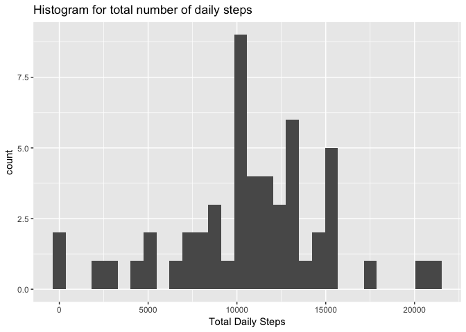
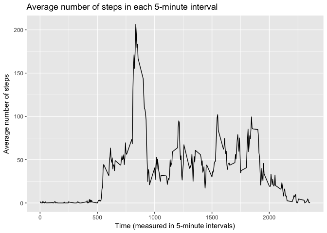
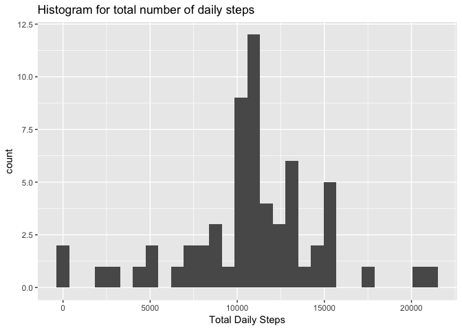

# Reproducible Research: Peer Assessment 1

```r
## Loading and preprocessing the data

activity<-read.csv(unzip("activity.zip"))

activity$date<-as.Date(activity$date)

## What is the mean total number of steps taken per day?

daily_steps<-aggregate(steps~date,activity,sum)

library(ggplot2)
```

```
## Warning: package 'ggplot2' was built under R version 3.3.2
```

```r
plot1<-ggplot(data=daily_steps,aes(steps))+
      labs(x="Total Daily Steps",title="Histogram for total number of daily steps")+
      geom_histogram()


print(plot1,type="html")
```

```
## `stat_bin()` using `bins = 30`. Pick better value with `binwidth`.
```

<!-- -->

```r
daily_steps_mean<-mean(daily_steps$steps)
daily_steps_median<-median(daily_steps$steps)

print(daily_steps_mean,type="html")
```

```
## [1] 10766.19
```

```r
print(daily_steps_median,type="html")
```

```
## [1] 10765
```

```r
## What is the average daily activity pattern?

average_steps<-aggregate(steps~interval,activity,mean)

plot2<-ggplot(data=average_steps,aes(interval,steps))+
     labs(x="Time (measured in 5-minute intervals)",y="Average number of steps",title="Average number of steps in each 5-minute interval")+
     geom_line()
     
max_interval<-average_steps[(average_steps$steps==max(average_steps$steps)),1]

print(plot2,type="html")
```

<!-- -->

```r
print(max_interval,type="html")
```

```
## [1] 835
```

```r
## Imputing missing values

total_na<-sum(is.na(activity))

print(total_na,type="html")
```

```
## [1] 2304
```

```r
# I choose the strategy of imputing by the mean of the corresponding interval.

activity2<-merge(activity,average_steps,by="interval", sort=FALSE, suffixes=c("",".y"))

na.steps<-is.na(activity2$steps)

activity2[na.steps,2]<-activity2[na.steps,4]

activity2$steps.y<-NULL

daily_steps2<-aggregate(steps~date,activity2,sum)

plot3<-ggplot(data=daily_steps2,aes(steps))+
      labs(x="Total Daily Steps",title="Histogram for total number of daily steps")+
      geom_histogram()

print(plot3,type="html")
```

```
## `stat_bin()` using `bins = 30`. Pick better value with `binwidth`.
```

<!-- -->

```r
daily_steps_mean2<-mean(daily_steps2$steps)
daily_steps_median2<-median(daily_steps2$steps)

print(daily_steps_mean2,type="html")
```

```
## [1] 10766.19
```

```r
print(daily_steps_median2,type="html")
```

```
## [1] 10766.19
```

```r
print("We can only see a slight difference in the median, which equals now the mean",type="html")
```

```
## [1] "We can only see a slight difference in the median, which equals now the mean"
```

```r
## Are there differences in activity patterns between weekdays and weekends?

activity2$weekdays<-weekdays(activity2$date,abbreviate=TRUE)

activity2$weekdays<-sapply(activity2$weekdays,function(x) if (x=="sáb"|x=="dom") x<-"weekend" else x<-"weekday")

activity2$weekdays<-factor(activity2$weekdays)

average_steps2<-aggregate(steps~interval+weekdays,activity2,mean)

library(lattice)

plot4<-xyplot(steps~interval|weekdays,data=average_steps2,layout=c(1,2),type="l",xlab="Interval",ylab="Number of steps")

print(plot4,type="html")
```

<!-- -->

```r
print("We can see than on weekdays the averages are higher throghout the day. However, on weekends the steps start earlier in the day and there is a higher max value")
```

```
## [1] "We can see than on weekdays the averages are higher throghout the day. However, on weekends the steps start earlier in the day and there is a higher max value"
```
